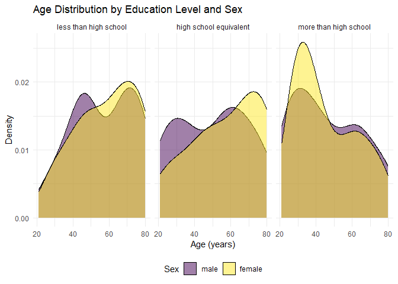
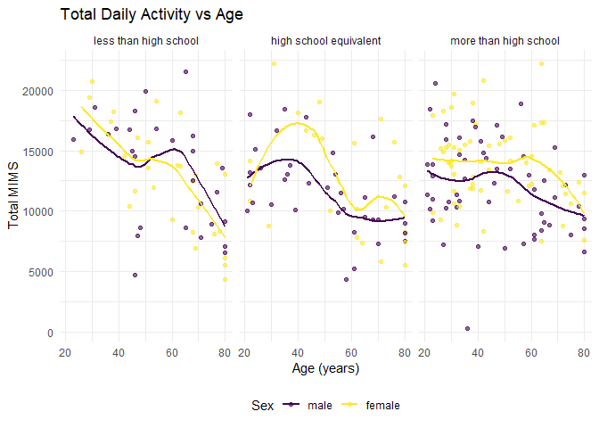
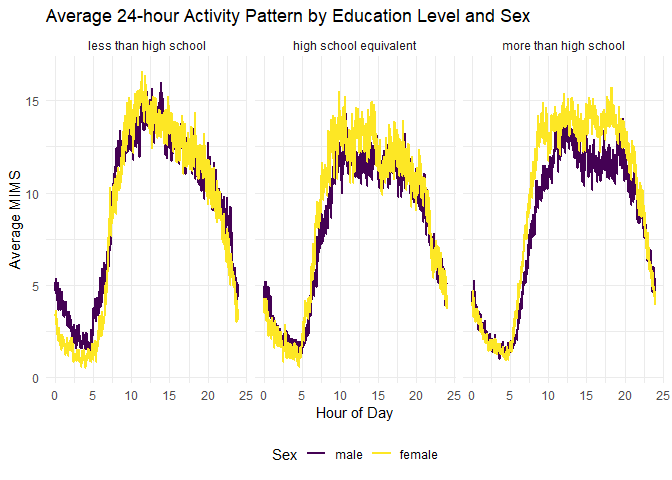

p8105_hw3_yd2865
================
Yan Duan
2025-10-10

I’m an R Markdown document!

## Problem 1

``` r
# View the data structure and overview
data("instacart")
instacart 
```

    ## # A tibble: 1,384,617 × 15
    ##    order_id product_id add_to_cart_order reordered user_id eval_set order_number
    ##       <int>      <int>             <int>     <int>   <int> <chr>           <int>
    ##  1        1      49302                 1         1  112108 train               4
    ##  2        1      11109                 2         1  112108 train               4
    ##  3        1      10246                 3         0  112108 train               4
    ##  4        1      49683                 4         0  112108 train               4
    ##  5        1      43633                 5         1  112108 train               4
    ##  6        1      13176                 6         0  112108 train               4
    ##  7        1      47209                 7         0  112108 train               4
    ##  8        1      22035                 8         1  112108 train               4
    ##  9       36      39612                 1         0   79431 train              23
    ## 10       36      19660                 2         1   79431 train              23
    ## # ℹ 1,384,607 more rows
    ## # ℹ 8 more variables: order_dow <int>, order_hour_of_day <int>,
    ## #   days_since_prior_order <int>, product_name <chr>, aisle_id <int>,
    ## #   department_id <int>, aisle <chr>, department <chr>

The “Instacart” dataset contains real shopping order information from
Instacart Online Grocery Shopping. The dataset consists of **1,384,617**
rows and **15** columns.

Key variables include: `order_id`: order identifier, `product_id`:
product identifier, `add_to_cart_order`: order in which each product was
added to cart, `reordered`: 1 if this prodcut has been ordered by this
user in the past, 0 otherwise, `user_id`: customer identifier,
`eval_set`: which evaluation set this order belongs in (Note that the
data for use in this class is exclusively from the “train” `eval_set`),
`order_number`: the order sequence number for this user (1=first,
n=nth), `order_dow`: the day of the week on which the order was placed,
`order_hour_of_day`: the hour of the day on which the order was placed,
`days_since_prior_order`: days since the last order, capped at 30, NA if
`order_number`=1, `product_name`: name of the product, `aisle_id`: aisle
identifier, `department_id`: department identifier, `aisle`: the name of
the aisle, `department`: the name of the department.

#### (1)

Calculate the number of aisles and determine the aisles with the highest
order volume.

``` r
aisle_df =
  instacart |> 
  group_by(aisle) |>             
  summarise(n_items = n()) |>   
  arrange(desc(n_items))         # Sort in descending order by quantity
n_aisles = nrow(aisle_df)   # The total number of aisles
n_aisles 
```

    ## [1] 134

``` r
head(aisle_df)    # The aisles with the highest number of orders
```

    ## # A tibble: 6 × 2
    ##   aisle                         n_items
    ##   <chr>                           <int>
    ## 1 fresh vegetables               150609
    ## 2 fresh fruits                   150473
    ## 3 packaged vegetables fruits      78493
    ## 4 yogurt                          55240
    ## 5 packaged cheese                 41699
    ## 6 water seltzer sparkling water   36617

There are a total of 134 aisles. The most frequently ordered aisles are
fresh vegetables, fresh fruits, and packaged vegetables fruits.

#### (b)

Make a plot that shows the number of items ordered in each aisle.(items
\> 10000)

``` r
aisle_df |> 
  filter(n_items > 10000) |>     # Only keep the aisles with an order quantity greater than 10,000
  mutate(aisle = fct_reorder(aisle, n_items)) |>  # Sort by quantity
  ggplot(aes(x = aisle, y = n_items)) +
  geom_col() +
  coord_flip() +                 # Reverse the axes
  labs(
    title = "Number of items ordered in each aisle (>10,000)",
    x = "Aisle",
    y = "Number of items ordered"
  ) 
```

<!-- -->

#### (c)

Make a table showing the three most popular items in three aisles.

``` r
popular_df = 
  instacart |> 
  filter(aisle %in% c("baking ingredients", 
                      "dog food care", 
                      "packaged vegetables fruits")) |> 
  group_by(aisle, product_name) |>
  summarise(n_orders = n()) |>
  arrange(aisle, desc(n_orders)) |>
  slice_head(n = 3)              # The three most popular products
```

    ## `summarise()` has grouped output by 'aisle'. You can override using the
    ## `.groups` argument.

``` r
popular_df
```

    ## # A tibble: 9 × 3
    ## # Groups:   aisle [3]
    ##   aisle                      product_name                               n_orders
    ##   <chr>                      <chr>                                         <int>
    ## 1 baking ingredients         Light Brown Sugar                               499
    ## 2 baking ingredients         Pure Baking Soda                                387
    ## 3 baking ingredients         Cane Sugar                                      336
    ## 4 dog food care              Snack Sticks Chicken & Rice Recipe Dog Tr…       30
    ## 5 dog food care              Organix Chicken & Brown Rice Recipe              28
    ## 6 dog food care              Small Dog Biscuits                               26
    ## 7 packaged vegetables fruits Organic Baby Spinach                           9784
    ## 8 packaged vegetables fruits Organic Raspberries                            5546
    ## 9 packaged vegetables fruits Organic Blueberries                            4966

#### (d)

Make a table showing the mean hour of the day at which Pink Lady Apples
and Coffee Ice Cream are ordered on each day of the week.

``` r
mean_hour_df =
  instacart |>
  filter(product_name %in% c("Pink Lady Apples", "Coffee Ice Cream")) |>
  mutate(order_dow = factor(order_dow,   #Convert numbers into text labels
  levels = 0:6,
  labels = c("Sun", "Mon", "Tue", "Wed", "Thu", "Fri", "Sat"))) |>  #Sort by week order
  group_by(product_name, order_dow) |>
  summarise(mean_hour = mean(order_hour_of_day), .groups = "drop") |>
  pivot_wider(
    names_from = order_dow,
    values_from = mean_hour)
mean_hour_df
```

    ## # A tibble: 2 × 8
    ##   product_name       Sun   Mon   Tue   Wed   Thu   Fri   Sat
    ##   <chr>            <dbl> <dbl> <dbl> <dbl> <dbl> <dbl> <dbl>
    ## 1 Coffee Ice Cream  13.8  14.3  15.4  15.3  15.2  12.3  13.8
    ## 2 Pink Lady Apples  13.4  11.4  11.7  14.2  11.6  12.8  11.9

## Problem 2

``` r
# Read, tidy and clean the Zillow data
zori_df = 
  read_csv("./zillow_data/Zip_zori_uc_sfrcondomfr_sm_month_NYC.csv", na = c("NA", ".", "")) |> 
  janitor::clean_names() |> 
  rename(zipcode = region_name) |> 
  mutate(
    county_name = str_replace(county_name, "county", ""),
    zipcode = as.integer(zipcode)) |>
  pivot_longer(       # Arrange the date data into a single column
    cols = 10:125,              
    names_to  = "date",
    values_to = "zori",
    names_prefix = "x") |> 
  mutate(
    date = ymd(date),                     # Convert to Date
    year = year(date)
  )
```

    ## Rows: 149 Columns: 125
    ## ── Column specification ────────────────────────────────────────────────────────
    ## Delimiter: ","
    ## chr   (6): RegionType, StateName, State, City, Metro, CountyName
    ## dbl (119): RegionID, SizeRank, RegionName, 2015-01-31, 2015-02-28, 2015-03-3...
    ## 
    ## ℹ Use `spec()` to retrieve the full column specification for this data.
    ## ℹ Specify the column types or set `show_col_types = FALSE` to quiet this message.

``` r
# Read, tidy and clean the data in Zip Codes data
zip_df = 
  read_csv("./zillow_data/Zip Codes.csv", na = c("NA", ".", "")) |>
  janitor::clean_names() |>
  mutate(
    county = recode(county, "New York" = "Manhattan"),
    zipcode = as.integer(zip_code)) |> 
  group_by(zipcode) |> 
  summarise(neighborhood = str_c(sort(unique(neighborhood)), collapse = "; "),
            borough = first(county))
```

    ## Rows: 322 Columns: 7
    ## ── Column specification ────────────────────────────────────────────────────────
    ## Delimiter: ","
    ## chr (4): County, County Code, File Date, Neighborhood
    ## dbl (3): State FIPS, County FIPS, ZipCode
    ## 
    ## ℹ Use `spec()` to retrieve the full column specification for this data.
    ## ℹ Specify the column types or set `show_col_types = FALSE` to quiet this message.

``` r
# Joining datasets
zori_tidy =
  left_join(zori_df, zip_df, by = "zipcode") |>
  filter(!is.na(borough))
```

#### (a)

``` r
# Calculate the number of months in which each ZIP code appears
zip_obs =
  zori_tidy |>
  group_by(zipcode) |>
  summarise(n_mon = n_distinct(date)) |>
  ungroup()

# Calculate how many postal codes were observed
zip_116 = sum(zip_obs$n_mon == 116)
zip_few = sum(zip_obs$n_mon < 10)
zip_116; zip_few
```

    ## [1] 149

    ## [1] 0

#### (b)

``` r
ave_rental =
  zori_tidy |>
  group_by(borough, year) |>
  summarise(mean_rent = mean(zori, na.rm = TRUE), .groups = "drop") |>
  pivot_wider(
    names_from = year,
    values_from = mean_rent) |> 
  mutate(across(where(is.numeric), ~ format(round(., 2), nsmall = 2))) |>
  ungroup() 

ave_rental |> 
  knitr::kable()
```

| borough | 2015 | 2016 | 2017 | 2018 | 2019 | 2020 | 2021 | 2022 | 2023 | 2024 |
|:---|:---|:---|:---|:---|:---|:---|:---|:---|:---|:---|
| Bronx | 1759.60 | 1520.19 | 1543.60 | 1639.43 | 1705.59 | 1811.44 | 1857.78 | 2054.27 | 2285.46 | 2496.90 |
| Kings | 2492.93 | 2520.36 | 2545.83 | 2547.29 | 2630.50 | 2555.05 | 2549.89 | 2868.20 | 3015.18 | 3125.66 |
| Manhattan | 3022.04 | 3038.82 | 3133.85 | 3183.70 | 3310.41 | 3106.52 | 3136.63 | 3778.37 | 3932.61 | 4078.44 |
| Queens | 2214.71 | 2271.96 | 2263.30 | 2291.92 | 2387.82 | 2315.63 | 2210.79 | 2406.04 | 2561.62 | 2693.58 |
| Richmond | NaN | NaN | NaN | NaN | NaN | 1977.61 | 2045.43 | 2147.44 | 2332.93 | 2536.44 |

The table presents the annual average rents for the five boroughs of New
York from 2015 to 2024. The overall trend is a continuous increase, but
the growth slowed down around 2020 (due to the impact of the pandemic).
Manhattan has always been the most expensive, with an average rent of
over \$4,000 in 2024, Kings (Brooklyn) follows, Queens and the Bronx are
relatively lower, with Richmond (Staten Island) being the lowest, but it
has also seen a significant increase since 2020. The rent disparities
among different districts have persisted for a long time, and they have
generally been increasing at an inflationary rate.

#### (c)

``` r
rental_plot =
  zori_tidy |>
  mutate(year = as.numeric(year)) |> 
  group_by(zipcode, borough, year) |>
  summarise(mean_rent = mean(zori, na.rm = TRUE), .groups = "drop") |>
  ggplot(aes(x = year, y = mean_rent)) +
  geom_line(aes(group = zipcode), alpha = 0.2, na.rm = TRUE) +
  geom_line(stat = "summary", fun = median, color = "black", linewidth = 1, na.rm = TRUE) +
  facet_wrap(~ borough) +
  labs(
    title = "NYC Rental Prices within ZIP codes(2015 - 2024)",
    x = "Year",
    y = "Rent Price (USD)")
rental_plot
```

<!-- -->

This plot presents the rental prices of ZIP areas in New York City from
2015 to 2024. Each gray line represents the rental trend within a ZIP
area, while the black lines indicate the median rental prices of each
administrative district.

Overall, the rental prices in all administrative districts are on the
rise, but with different growth rates. Throughout the period, the median
rental price in Manhattan has always been the highest, followed by Kings
(Brooklyn) and Queens. The rents in Bronx and Richmond (Staten Island)
are relatively lower.

Around 2020, a significant pattern emerged. At that time, the rental
prices in most administrative districts experienced a brief
stabilization or a slight decrease, which might reflect the temporary
impact of the COVID-19 pandemic on rental demand. After 2021, the rental
prices in all administrative districts continued to rise, while
Manhattan showed a significant rebound after the pandemic.

#### (d)

``` r
zori_2023 = 
  zori_tidy |>
  filter(year == 2023)

# Calculate the average rent for each ZIP code in 2023
zori_2023_sum = 
  zori_2023 |>
  group_by(borough, zipcode) |>
  summarise(
    mean_rent = mean(zori, na.rm = TRUE), .groups = "drop") |> 
  filter(!is.na(mean_rent))

# Make a plot
rental_2023_plot = 
  ggplot(zori_2023_sum, aes(x = borough, y = mean_rent, fill = borough)) +
  geom_boxplot(alpha = 0.7) +
  labs(
    title = "Distribution of Average 2023 Rental Prices by Borough",
    x = "Borough",
    y = "Average Monthly Rent (USD)"
  )
rental_2023_plot
```

<!-- -->

This box plot presents the distribution of average monthly rents by
postal code in each borough of New York City in 2023. Each box
represents the interquartile range (IQR) of rents for the corresponding
postal code level, and the horizontal line within each box indicates the
median value. This plot clearly presents the ranking of rent levels in
each district.

The rent levels in Manhattan are the highest and the range is the
widest, indicating that this area is the most expensive in terms of
housing prices and also reflecting the greatest rent differences between
different postal code areas. King (Brooklyn) follows closely behind,
with moderate rent levels and significant rent differences, reflecting
the diverse community situation in this administrative district. The
median rents in Queens and the Bronx are lower, with relatively
concentrated rent distributions, meaning greater affordability and
smaller differences. Richmond (Staten Island) has the lowest overall
rent level and the smallest differences, indicating a relatively stable
and unified rental market.

#### (e)

``` r
# Combine the two previous plots into a single graphic
combine_plot = (rental_plot / rental_2023_plot)

# Export the image to the "results" folder
if(!dir.exists("results")) dir.create("results")
ggsave("results/combined_plot.png", combine_plot,
       width = 12, height = 10, dpi = 300)
```

## Problem 3

``` r
# Read, tidy and clean the accelerometer data
accel_df =
  read_csv("./nhanes_accel.csv", na = c("NA", ".", "")) |> 
  janitor::clean_names() |>               
  pivot_longer(                    # Convert to one line per minute
    cols = starts_with("min"),
    names_to = "minute",
    values_to = "mims") |>     
  mutate(
    seqn = as.character(seqn),
    minute = as.numeric(str_remove(minute, "min")),  # Extract the number of minutes
    hour = minute / 60)
```

    ## Rows: 250 Columns: 1441
    ## ── Column specification ────────────────────────────────────────────────────────
    ## Delimiter: ","
    ## dbl (1441): SEQN, min1, min2, min3, min4, min5, min6, min7, min8, min9, min1...
    ## 
    ## ℹ Use `spec()` to retrieve the full column specification for this data.
    ## ℹ Specify the column types or set `show_col_types = FALSE` to quiet this message.

``` r
# Read, tidy and clean the demographic data
demo_df =
  read_csv("./nhanes_covar.csv", na = c("NA", ".", ""), skip = 4) |>
  janitor::clean_names() |>
  filter(age >= 21) |>            # exclude participants less than 21 years of age
  drop_na(sex, age, education) |>       
  mutate(
    seqn = as.character(seqn),
    sex = fct_recode(as.factor(sex),
                     "male"   = "1",
                     "female" = "2"),
    education = fct_recode(as.factor(education),
                           "less than high school" = "1", 
                           "high school equivalent" = "2", 
                           "more than high school" = "3"))
```

    ## Rows: 250 Columns: 5
    ## ── Column specification ────────────────────────────────────────────────────────
    ## Delimiter: ","
    ## dbl (5): SEQN, sex, age, BMI, education
    ## 
    ## ℹ Use `spec()` to retrieve the full column specification for this data.
    ## ℹ Specify the column types or set `show_col_types = FALSE` to quiet this message.

``` r
# Joining datasets
accel_tidy =
  left_join(accel_df, demo_df, by = "seqn")
```

#### (a)

``` r
# Produce a reader-friendly table for the number of men and women in each education category
sex_edu_tbl =
  accel_tidy |>
  distinct(seqn, sex, education) |>
  filter(!is.na(education), !is.na(sex)) |>
  count(education, sex) |>                 
  pivot_wider(names_from = sex, values_from = n) 

sex_edu_tbl |> 
  knitr::kable()
```

| education              | male | female |
|:-----------------------|-----:|-------:|
| less than high school  |   28 |     29 |
| high school equivalent |   36 |     23 |
| more than high school  |   56 |     59 |

``` r
# create a visualization of the age distributions for men and women in each education category
age_edu_plot = 
  accel_tidy |>
  distinct(seqn, age, sex, education) |>  
  filter(!is.na(education)) |>     
  ggplot(aes(x = age, fill = sex)) +
  geom_density(alpha = 0.5) +
  facet_wrap(~ education) +
  labs(title = "Age Distribution by Education Level and Sex",
       x = "Age (years)", y = "Density", fill = "Sex")
age_edu_plot
```

<!-- -->

The table shows the distribution of the number of men and women at
different educational levels. Overall, the gender ratio is relatively
balanced. In the “less than high school” group, there are 28 men and 29
women, almost equal. In the “high school equivalent” group, there are 36
men and 23 women, with more men. While in the “more than high school”
group, the number of men (56) is roughly the same as that of women (59).

From the age distribution plot, one can further observe the differences
among various educational levels. The individuals in the “less than high
school” group have a higher average age, and the density is higher in
the age range above 50 years old. The age distribution of the “high
school equivalent” group is relatively broad, covering a wider age
range, while the distribution of the “more than high school” group leans
towards younger people, indicating that participants with higher
educational attainment are generally younger on average.

#### (b)

Analyze the total activity level for the entire day.

``` r
total_act =
  accel_tidy |>
  filter(!is.na(education), !is.na(sex)) |>
  group_by(seqn, sex, education, age) |>
  summarise(total_mims = sum(mims, na.rm = TRUE), .groups = "drop") |>
  ggplot(aes(x = age, y = total_mims, color = sex)) +
  geom_point(alpha = 0.6) +
  geom_smooth(se = FALSE) +
  facet_wrap(~ education) +
  labs(title = "Total Daily Activity vs Age",
       x = "Age (years)", y = "Total MIMS", color = "Sex")
total_act
```

    ## `geom_smooth()` using method = 'loess' and formula = 'y ~ x'

<!-- -->

This plot illustrates the trend of total daily activity (Total MIMS)
over age, and it is categorized by gender and educational level. In all
educational level groups, overall activity generally decreases as age
increases. In the “less than high school” group, both men and women’s
activity levels significantly decline after the age of 40. In the “high
school equivalent” group, women have higher activity levels in most age
ranges and experience significant fluctuations in middle age. While in
the “more than high school” group, both men and women have higher and
more stable overall activity levels, but they still show a gradually
decreasing trend after the age of 60.

#### (c)

Analyze the 24-hour activity patterns under different educational levels
and genders.

``` r
hourly_act =
  accel_tidy |>
  filter(!is.na(education), !is.na(sex)) |> 
  group_by(hour, sex, education) |>
  summarise(mean_mims = mean(mims, na.rm = TRUE), .groups = "drop") |>
  ggplot(aes(x = hour, y = mean_mims, color = sex)) +
  geom_line(linewidth = 1) +
  facet_wrap(~ education) +
  labs(title = "Average 24-hour Activity Pattern by Education Level and Sex",
       x = "Hour of Day", y = "Average MIMS", color = "Sex")
hourly_act
```

<!-- -->

This plot illustrates the 24-hour activity patterns under different
educational levels and genders.

Overall, both men and women exhibit distinct circadian rhythms. Their
activity levels are relatively low during the night (approximately
0:00 - 6:00), increase rapidly after 7 a.m., reach a peak around noon,
and then gradually decrease in the afternoon and evening. The average
daily activity level (MIMS) of women is slightly higher than that of men
throughout the day, and the difference is particularly significant in
the “more than high school” group.

From the perspective of educational level, people with higher
educational attainment exhibit smoother and more regular daily activity
curves, and have a higher overall level of activity.
